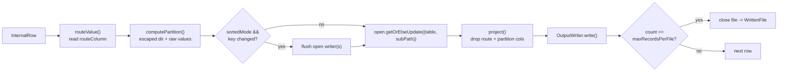

# Architecture

This sink plugs into Spark's **DataSource V2 (DSv2)** write API. The guiding idea:
own the **write** path (scan once, route rows, write Parquet) but reuse Delta's
**commit** path (`AddFile`/`RemoveFile` transactions). Everything below follows
from that split.

## Driver vs. executor

```mermaid
flowchart TB
    subgraph DRIVER["DRIVER — planning & commit (one JVM)"]
        direction TB
        SRC["MultiDeltaSource<br/><i>TableProvider, DataSourceRegister</i><br/>resolves format(\"multiDelta\")"]
        TBL["MultiDeltaTable<br/><i>SupportsWrite</i><br/>capabilities: BATCH_WRITE, TRUNCATE"]
        WB["MultiDeltaWriteBuilder<br/><i>WriteBuilder, SupportsTruncate</i><br/>truncate() => overwrite=true"]
        WR["MultiDeltaWrite<br/><i>Write, RequiresDistributionAndOrdering</i><br/>requests local sort (opt-in)"]
        BW["MultiDeltaBatchWrite<br/><i>BatchWrite</i><br/>• split schema (table vs data)<br/>• validate partitions<br/>• prepareWrite -> Parquet factory<br/>• serialize job config"]
        COMMIT["commit(messages)"]
        DC["DeltaCommitter<br/>txn per table:<br/>metadata? + RemoveFile? + AddFiles"]
        PC["ParquetCommitter<br/>_SUCCESS / delete stale"]
        SRC --> TBL --> WB --> WR --> BW
        BW -.->|"createBatchWriterFactory"| FAC
        BW --> COMMIT
        COMMIT --> DC
        COMMIT --> PC
    end

    subgraph EXEC["EXECUTORS — the single pass (N tasks)"]
        direction TB
        FAC["MultiDeltaWriterFactory<br/><i>DataWriterFactory (serializable)</i>"]
        DW["MultiDeltaDataWriter<br/><i>DataWriter[InternalRow]</i><br/>one open Parquet writer<br/>per (table, partition)"]
        FAC -->|"createWriter(pid, tid)"| DW
    end

    DW -->|"MultiDeltaCommitMessage<br/>Seq[WrittenFile]"| COMMIT

    style DRIVER fill:#1f2937,color:#e5e7eb,stroke:#4b5563
    style EXEC fill:#0f3d2e,color:#d1fae5,stroke:#065f46
```

The whole left column runs **once on the driver**; only
`MultiDeltaWriterFactory` (and what it captures) is serialized to executors. The
Parquet `OutputWriterFactory` is built on the driver via
`ParquetFileFormat.prepareWrite` — that call mutates the job Configuration with
the write-support class + schema, which is exactly why the *job's* config (not the
bare session config) is what gets serialized to executors.

## A write, end to end

```mermaid
sequenceDiagram
    participant U as df.write.format("multiDelta")
    participant S as Spark planner
    participant BW as MultiDeltaBatchWrite (driver)
    participant DW as MultiDeltaDataWriter (executor xN)
    participant C as DeltaCommitter / ParquetCommitter (driver)

    U->>S: save()  (append | overwrite)
    S->>BW: resolve chain, build Write
    Note over S: RequiresDistributionAndOrdering<br/>may insert a LOCAL sort
    BW->>BW: prepareWrite -> Parquet factory<br/>serialize job config
    BW->>DW: ship serializable factory
    loop each input partition (single scan)
        DW->>DW: route -> partition path -> project -> write
        Note over DW: roll at maxRecordsPerFile;<br/>close-on-key-change if sorted
    end
    DW-->>BW: MultiDeltaCommitMessage(Seq[WrittenFile])
    BW->>C: group files by table
    loop each touched table
        C->>C: delta: txn.commit(removes ++ adds)<br/>parquet: _SUCCESS / delete stale
    end
```

## Inside `MultiDeltaDataWriter` — the per-row pipeline

This is where the single-pass fan-out actually happens. One instance per Spark
task; the source is scanned exactly once.



Key: partition columns live in the **path**, not the file, so `project()` drops
both the routing column (if `dropRouteColumn`) and the partition columns. The
resulting `dataSchema` is what the Parquet files hold; `tableSchema` (which keeps
partition columns) is what Delta records as the table schema.

## Where each concern lives

| Concern | Class / method | Side |
|---|---|---|
| Format resolution (`multiDelta`) | `MultiDeltaSource` + `META-INF/services` | driver |
| `overwrite` routing | `SupportsTruncate.truncate()` + `TRUNCATE` capability | driver |
| Opt-in local sort | `MultiDeltaWrite.requiredOrdering()` | driver (planner) |
| Schema split (table vs data), partition validation | `MultiDeltaBatchWrite` | driver |
| Parquet writer construction | `ParquetFileFormat.prepareWrite` | driver |
| Row routing, partition path, projection | `MultiDeltaDataWriter.write()` | executor |
| File rolling (`maxRecordsPerFile`) | `MultiDeltaDataWriter.write()` | executor |
| Bounded writers (close-on-key-change) | `MultiDeltaDataWriter` (`sortedMode`) | executor |
| Executor→driver payload | `WrittenFile` / `MultiDeltaCommitMessage` | boundary |
| Delta transaction (append/overwrite) | `DeltaCommitter` | driver |
| Parquet finalize (`_SUCCESS`, stale delete) | `ParquetCommitter` | driver |

## The two seams that make it work (and their costs)

1. **Write path is ours.** We don't call Delta's `writeFiles`, so features that
   live there — Synapse/Databricks *Optimized Write* — do not apply. We emulate
   the effect with the `REBALANCE` hint + `maxRecordsPerFile` + `sortWithinPartitions`.
2. **Commit path is Delta's.** We call `txn.commit(...)` per table, so we inherit
   Delta's ACID commit *per table* — but there is no cross-table atomicity (N
   independent transactions). Post-commit hooks like *Auto Compact* may still fire
   because we go through the real `commit`.
